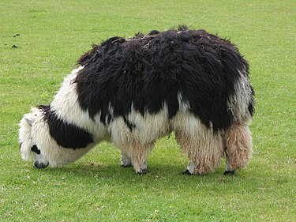
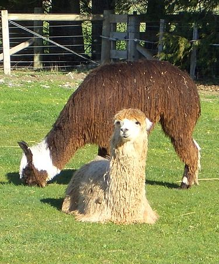

```{=html}
<style type="text/css">
  body{
  font-size: 12pt;
}
</style>
```
```{r setup, include=FALSE}
knitr::opts_chunk$set(echo = TRUE)
```

La alpaca (del quechua allpaqa, paqu o a veces paqucha, a través del aimara allpaqa) (Vicugna pacos) es una especie doméstica de mamífero artiodáctilo de la familia Camelidae. Evolutivamente está emparentada con la vicuña, aunque en las poblaciones actuales hay una fuerte introgresión genética de la llama (Lama glama).1​ Su domesticación se viene realizando desde hace miles de años. Podemos encontrar restos arqueológicos de la cultura mochica del Perú con representaciones de alpacas.

## Características

Las alpacas pesan entre 45 y 77 kg y su altura en la cruz es de 90 cm,3​ superadas levemente por la vicuña, su ancestro. La estatura de la alpaca es considerablemente menor que la de la llama, compartiendo con esta y con el camello el hábito de escupir, utilizado para mostrar agresividad o como método de defensa.

## Razas

Existen dos razas de alpaca, las que se diferencian por las características externas de su fibra.

### Huacaya

La fibra de la huacaya crece en forma perpendicular al cuerpo de la alpaca, posee densidad, suavidad, lustre, rizos (crimp) que le confieren un aspecto esponjoso, las mechas de fibra son más cortas en comparación con la suri, con ausencia de suarda que es propio del ovino.

{width="269"}

### Suri

La fibra de la suri crece en forma paralela al cuerpo de la alpaca, formando rulos independientes a través de todo el cuerpo a manera de los flecos del mantón de las mujeres altoandinas, posee densidad, suavidad, y lustre mucho más notorios que en la de la huacaya, confiriéndole un aspecto sedoso y brillante.

{width="257"}

### Población en Perú

```{r, echo=FALSE, warning=FALSE, message=FALSE}
#Set workind directory
library('here')

#Read the table
poblacion_alpacas <- readxl::read_xlsx('alpacas.xlsx')

knitr::kable(poblacion_alpacas, caption = 'Población de alpacas Perú', align = 'l')
```

Vamos a ver la evolución de esta población.

```{r, echo=FALSE}
#Cargamos la libreria
library('ggplot2')

#Agregamos una variable ficticia de grupo para poder marcar una linea de evolución en el gráfico con 'geom_line'
poblacion_alpacas$grupo <- 1

#Creamos el gráfico de evolución con tendencia
ggplot(poblacion_alpacas, aes(x = Año, y = Población, group = grupo)) +
  geom_point() +
  geom_line() +
  labs(x = "Año", y = "Población", title = "Evolución de la población de alpacas en Perú") +
  theme_minimal()
```

Si observamos el gráfico podemos observar como del 2011 al 2012 la población de alpacas en Perú tuvo un declive sustancial de 400.000 individuos. Este declive se ha ido recuperando con los años hasta llegar en 2016 casi al número de individuos de 2011.
